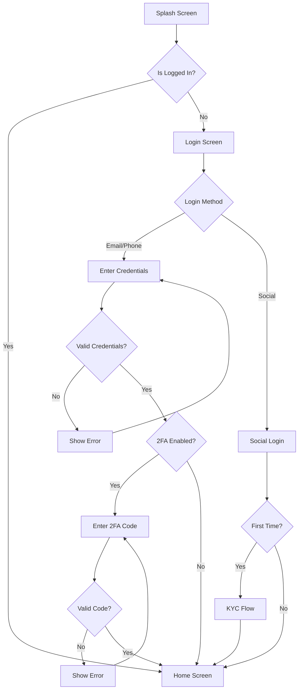
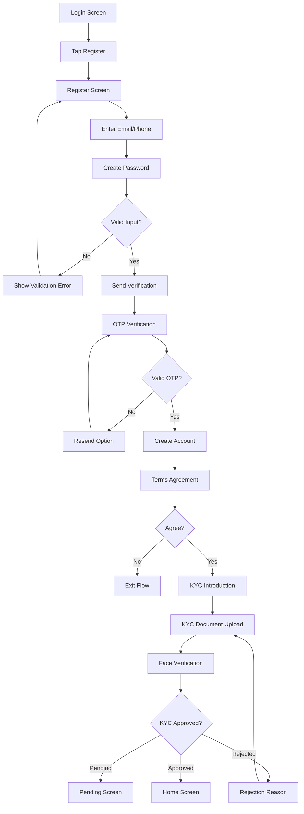
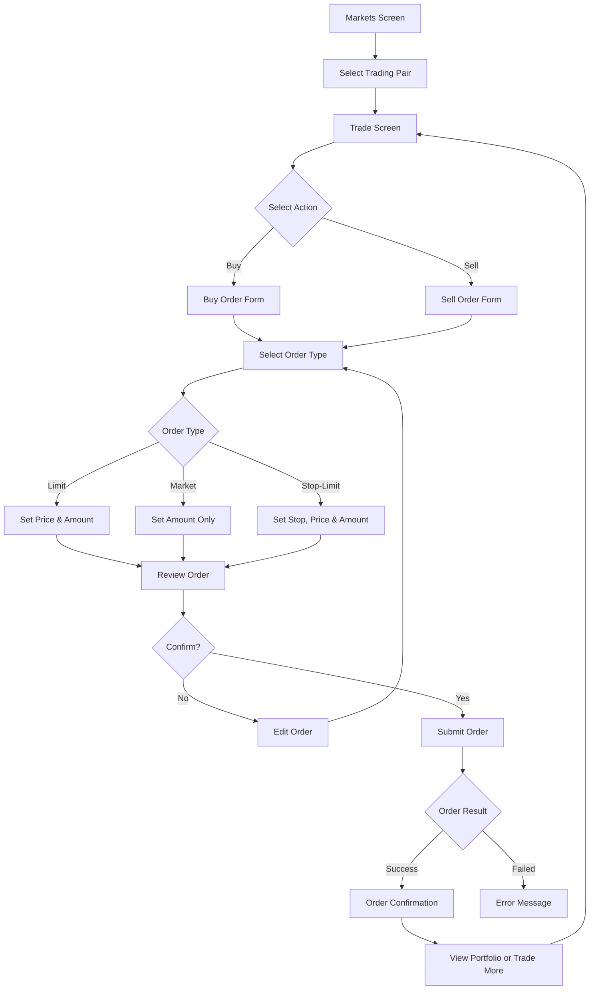
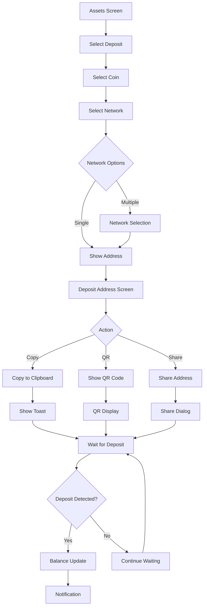
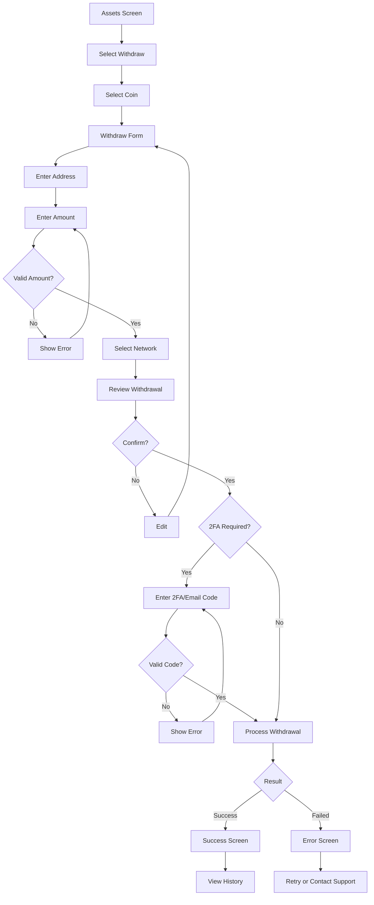
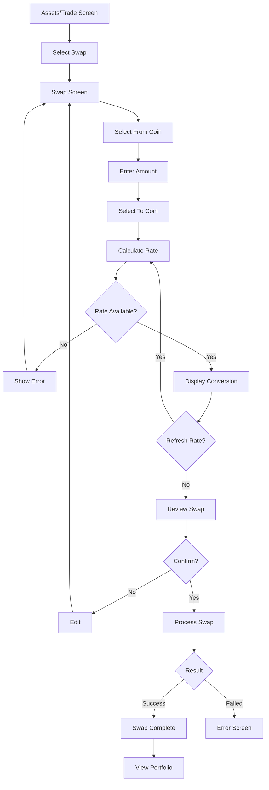
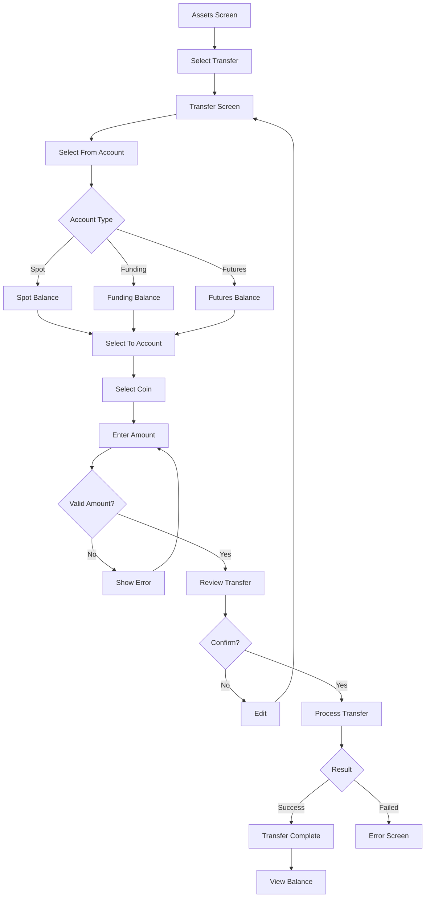

# Binance UI/UX Knowledge Base - Screen Flows & Navigation

## Overview

This document provides comprehensive documentation of all user flows and navigation patterns in the Binance Android app, including screen-to-screen mappings, back button behavior, and deep link patterns.

---

## Navigation Architecture

### Bottom Navigation Structure

The app uses a 5-tab bottom navigation as the primary navigation pattern.

```text
┌─────────────────────────────────────────────────────────┐
│                                                         │
│                    Main Content                         │
│                                                         │
├─────────┬─────────┬─────────┬─────────┬─────────────────┤
│  Home   │ Markets │  Trade  │ Futures │     Assets      │
│   🏠    │   📊    │   📈    │   ⚡    │       💰        │
└─────────┴─────────┴─────────┴─────────┴─────────────────┘
```

### Navigation Hierarchy

```text
App
├── Main Activity (Bottom Nav Container)
│   ├── Home Fragment
│   ├── Markets Fragment
│   ├── Trade Fragment
│   ├── Futures Fragment
│   └── Assets Fragment
│
├── Auth Flow
│   ├── Splash Screen
│   ├── Login Screen
│   ├── Register Screen
│   ├── OTP Verification
│   └── KYC Verification
│
├── Trading Flow
│   ├── Pair Selection
│   ├── Chart View
│   ├── Order Form
│   └── Order Confirmation
│
├── Assets Flow
│   ├── Asset List
│   ├── Deposit
│   ├── Withdraw
│   ├── Transfer
│   └── Transaction History
│
└── Settings Flow
    ├── Profile
    ├── Security
    ├── Preferences
    └── About
```

---

## User Flow Diagrams

### 1. Login Flow



**Screen Sequence**:

1. **Splash Screen** → Auto-check login state
2. **Login Screen** → Email/Phone + Password
3. **OTP Screen** → 6-digit code input
4. **Home Screen** → Main dashboard

**Back Button Behavior**:

| Screen | Back Action                             |
| ------ | --------------------------------------- |
| Splash | Exit app                                |
| Login  | Exit app                                |
| OTP    | Return to Login                         |
| Home   | Exit app (with double-tap confirmation) |

---

### 2. Registration Flow



**Screen Sequence**:

1. **Register Screen** → Email/Phone input
2. **Password Creation** → Password + Confirm
3. **OTP Verification** → Verify contact
4. **Terms & Conditions** → Agreement checkboxes
5. **KYC Intro** → Explain verification
6. **Document Upload** → ID/Passport
7. **Selfie Verification** → Face scan
8. **Home Screen** → Account ready

**Back Button Behavior**:

| Screen    | Back Action             |
| --------- | ----------------------- |
| Register  | Return to Login         |
| Password  | Return to Register      |
| OTP       | Return to Password      |
| Terms     | Return to OTP           |
| KYC Steps | Return to previous step |
| Home      | Exit app                |

---

### 3. Trading Flow



**Screen Sequence**:

1. **Markets Screen** → Browse pairs
2. **Trade Screen** → Chart + Order form
3. **Order Form** → Configure order
4. **Confirmation Dialog** → Review details
5. **Result Screen** → Success/Failure

**Back Button Behavior**:

| Screen       | Back Action                   |
| ------------ | ----------------------------- |
| Markets      | Return to previous tab        |
| Trade        | Return to Markets             |
| Order Form   | Cancel order, return to Trade |
| Confirmation | Return to Order Form          |
| Result       | Return to Trade               |

---

### 4. Deposit Flow



**Screen Sequence**:

1. **Assets Screen** → Tap Deposit
2. **Coin Selection** → Choose cryptocurrency
3. **Network Selection** → Choose network (if multiple)
4. **Deposit Address** → View address/QR
5. **Confirmation** → Wait for transaction

**Back Button Behavior**:

| Screen            | Back Action                 |
| ----------------- | --------------------------- |
| Coin Selection    | Return to Assets            |
| Network Selection | Return to Coin Selection    |
| Deposit Address   | Return to Network Selection |

---

### 5. Withdraw Flow



**Screen Sequence**:

1. **Assets Screen** → Tap Withdraw
2. **Coin Selection** → Choose cryptocurrency
3. **Withdraw Form** → Address + Amount
4. **Network Selection** → Choose network
5. **Review Screen** → Confirm details
6. **2FA Verification** → Security check
7. **Result Screen** → Success/Failure

**Back Button Behavior**:

| Screen            | Back Action              |
| ----------------- | ------------------------ |
| Coin Selection    | Return to Assets         |
| Withdraw Form     | Return to Coin Selection |
| Network Selection | Return to Withdraw Form  |
| Review            | Return to Withdraw Form  |
| 2FA               | Cancel withdrawal        |
| Result            | Return to Assets         |

---

### 6. Swap Flow



**Screen Sequence**:

1. **Swap Entry** → From Assets or Trade
2. **Swap Screen** → Configure swap
3. **Coin Selection** → From/To coins
4. **Amount Input** → Enter amount
5. **Rate Display** → See conversion
6. **Confirmation** → Review and confirm
7. **Result Screen** → Success/Failure

---

### 7. Transfer Flow (Internal)



**Account Types**:

- **Spot Assets** → Main trading balance
- **Funding Assets** → P2P and earn products
- **Futures Assets** → Futures trading balance
- **Earn Assets** → Staking and savings

**Screen Sequence**:

1. **Assets Screen** → Tap Transfer
2. **Transfer Screen** → Select accounts
3. **Coin Selection** → Choose asset
4. **Amount Input** → Enter amount
5. **Confirmation** → Review transfer
6. **Result Screen** → Success/Failure

---

## Screen-to-Screen Navigation Mappings

### Home Screen Navigation

| Element                      | Destination                                              |
| ---------------------------- | -------------------------------------------------------- |
| Menu / Notifications         | Profile / Notification Center                            |
| App Mode (Exchange/Web3)     | Switches between Pro Trading and Web3 Assets view        |
| Global Search Bar            | Search Screen (Coins, Articles, Features)                |
| Scan/Pay Icon                | QR Scanner / Binance Pay                                 |
| Add Funds Button             | Fiat Deposit / P2P Purchase                              |
| Portfolio Daily PNL          | Detailed PNL Analysis Screen                             |
| Promo Cards                  | Associated Promotional/Event Screen                      |
| Market Mini-Cards            | Trade Screen (specific pair)                             |
| Contextual Action: P2P       | P2P Trading Hub                                          |
| Contextual Action: Send Cash | Transfer/Send Funds Screen                               |
| Content Feed Tabs            | Filters infinite scroll feed (Discover, Following, etc.) |

### Markets Screen Navigation

| Element       | Destination         |
| ------------- | ------------------- |
| Search Bar    | Search Screen       |
| Favorites Tab | Favorites List      |
| Hot Tab       | Hot Pairs List      |
| Gainers Tab   | Gainers List        |
| Losers Tab    | Losers List         |
| New Tab       | New Listings        |
| Pair Item     | Trade Screen (pair) |
| Star Icon     | Add to Favorites    |
| Filter Button | Filter Options      |

### Trade Screen Navigation

| Element       | Destination          |
| ------------- | -------------------- |
| Pair Selector | Pair Selection Sheet |
| Chart         | Fullscreen Chart     |
| Order Book    | Expanded Order Book  |
| Recent Trades | Full Trade History   |
| Buy Button    | Buy Order Form       |
| Sell Button   | Sell Order Form      |
| Open Orders   | Order Management     |
| Trade History | History Screen       |

### Assets Screen Navigation

| Element             | Destination    |
| ------------------- | -------------- |
| Total Balance       | Balance Detail |
| Deposit Button      | Deposit Flow   |
| Withdraw Button     | Withdraw Flow  |
| Transfer Button     | Transfer Flow  |
| Swap Button         | Swap Flow      |
| Asset Item          | Asset Detail   |
| Transaction History | History Screen |
| Earn Button         | Earn Products  |

---

## Back Button Behavior

### Global Back Stack

```text
┌─────────────────────────────────────────────────────────┐
│                    Back Stack                           │
├─────────────────────────────────────────────────────────┤
│  Top: Current Screen                                    │
│  ...                                                    │
│  Bottom: Main Screen (Home/Markets/Trade/Futures/Assets)│
└─────────────────────────────────────────────────────────┘
```

### Back Behavior by Screen Type

| Screen Type   | Back Action             |
| ------------- | ----------------------- |
| Main Tab      | Exit app (double-tap)   |
| Detail Screen | Return to parent        |
| Form Screen   | Discard changes dialog  |
| Flow Screen   | Previous step or cancel |
| Modal/Dialog  | Dismiss                 |
| Bottom Sheet  | Close sheet             |

### Double-Tap Exit

**Implementation**:

- First back press: Show toast "Press again to exit"
- Second back press (within 2 seconds): Exit app
- Timeout: Reset counter after 2 seconds

---

## Deep Link Patterns

### URL Scheme

```text
binance://
```

### Deep Link Routes

| Route                     | Destination       | Parameters         |
| ------------------------- | ----------------- | ------------------ |
| `/home`                   | Home Screen       | -                  |
| `/markets`                | Markets Screen    | -                  |
| `/trade/{pair}`           | Trade Screen      | pair: BTCUSDT      |
| `/assets`                 | Assets Screen     | -                  |
| `/assets/deposit/{coin}`  | Deposit Screen    | coin: BTC          |
| `/assets/withdraw/{coin}` | Withdraw Screen   | coin: BTC          |
| `/swap`                   | Swap Screen       | -                  |
| `/swap/{from}/{to}`       | Swap Screen       | from: BTC, to: ETH |
| `/futures/{pair}`         | Futures Screen    | pair: BTCUSDT      |
| `/earn`                   | Earn Products     | -                  |
| `/kyc`                    | KYC Flow          | -                  |
| `/settings`               | Settings          | -                  |
| `/security`               | Security Settings | -                  |

### Example Deep Links

```text
binance://trade/BTCUSDT
binance://assets/deposit/ETH?network=ERC20
binance://swap/BTC/USDT
binance://futures/ETHUSDT
```

### Web to App Links

| Web URL                          | App Destination |
| -------------------------------- | --------------- |
| `www.binance.com/trade/BTC_USDT` | Trade Screen    |
| `www.binance.com/assets`         | Assets Screen   |
| `www.binance.com/earn`           | Earn Products   |

### Push Notification Deep Links

| Notification Type | Deep Link                  |
| ----------------- | -------------------------- |
| Price Alert       | `binance://trade/{pair}`   |
| Order Filled      | `binance://assets/history` |
| Deposit Received  | `binance://assets`         |
| Security Alert    | `binance://security`       |
| Promotion         | `binance://promo/{id}`     |

---

## Navigation Transitions

### Standard Transitions

| Transition   | Animation         |
| ------------ | ----------------- |
| Forward      | Slide from right  |
| Back         | Slide to right    |
| Modal        | Slide from bottom |
| Bottom Sheet | Slide from bottom |
| Dialog       | Fade in           |

### Tab Switching

- No animation between tabs
- Preserve scroll position per tab
- Maintain state per tab

---

## Navigation Component Implementation

### Nav Graph Structure

```xml
<navigation xmlns:android="http://schemas.android.com/apk/res/android"
    app:startDestination="@id/homeFragment">

    <!-- Main Tabs -->
    <fragment
        android:id="@+id/homeFragment"
        android:name="com.binance.app.home.HomeFragment" />

    <fragment
        android:id="@+id/marketsFragment"
        android:name="com.binance.app.markets.MarketsFragment" />

    <fragment
        android:id="@+id/tradeFragment"
        android:name="com.binance.app.trade.TradeFragment" />

    <fragment
        android:id="@+id/assetsFragment"
        android:name="com.binance.app.assets.AssetsFragment" />

    <!-- Auth Flow -->
    <navigation android:id="@+id/authNavGraph"
        app:startDestination="@id/loginFragment">
        <fragment
            android:id="@+id/loginFragment"
            android:name="com.binance.app.auth.LoginFragment" />
        <fragment
            android:id="@+id/otpFragment"
            android:name="com.binance.app.auth.OtpFragment" />
    </navigation>

    <!-- Trading Flow -->
    <navigation android:id="@+id/tradeNavGraph"
        app:startDestination="@id/tradeMainFragment">
        <fragment
            android:id="@+id/tradeMainFragment"
            android:name="com.binance.app.trade.TradeMainFragment" />
        <fragment
            android:id="@+id/orderConfirmationFragment"
            android:name="com.binance.app.trade.OrderConfirmationFragment" />
    </navigation>
</navigation>
```

---

## Navigation State Management

### State Preservation

| Screen  | State Preserved                             |
| ------- | ------------------------------------------- |
| Markets | Scroll position, selected tab, search query |
| Trade   | Selected pair, chart zoom, order form data  |
| Assets  | Selected filter, scroll position            |
| Forms   | Input values (until submitted)              |

### Arguments Passing

| Destination     | Arguments                              |
| --------------- | -------------------------------------- |
| Trade Screen    | `pair: String`, `action: String?`      |
| Deposit Screen  | `coinId: String`, `network: String?`   |
| Withdraw Screen | `coinId: String`, `address: String?`   |
| Swap Screen     | `fromCoin: String?`, `toCoin: String?` |

---

## Notes

1. Bottom navigation provides persistent access to main sections
2. Back stack is cleared when switching between main tabs
3. Modal flows (auth, trading) have their own back stacks
4. Deep links restore full navigation stack
5. Double-tap back to exit prevents accidental exits
6. All forms show confirmation dialog on back with unsaved changes
7. Bottom sheets dismiss on back press without affecting back stack
8. Navigation state is preserved during configuration changes
